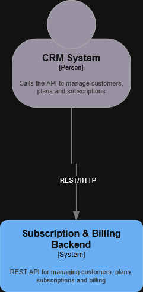
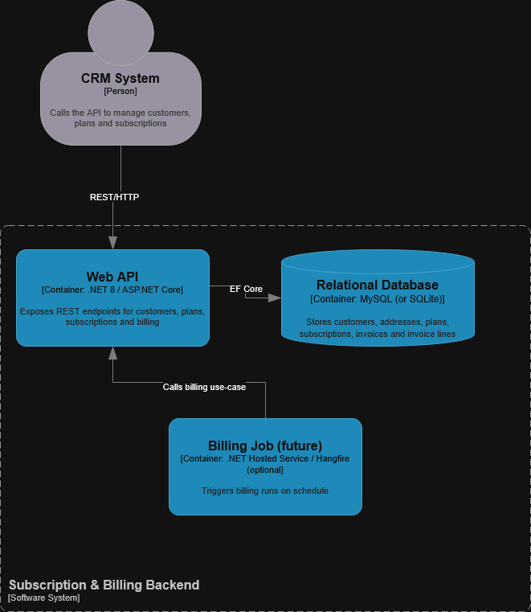
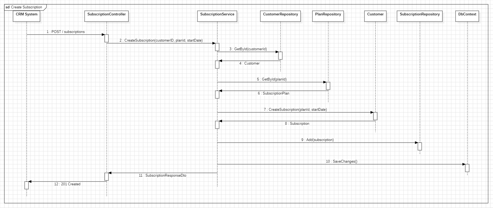
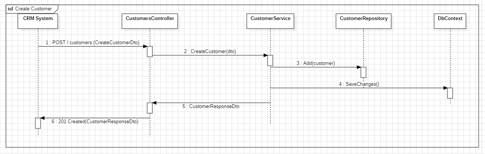
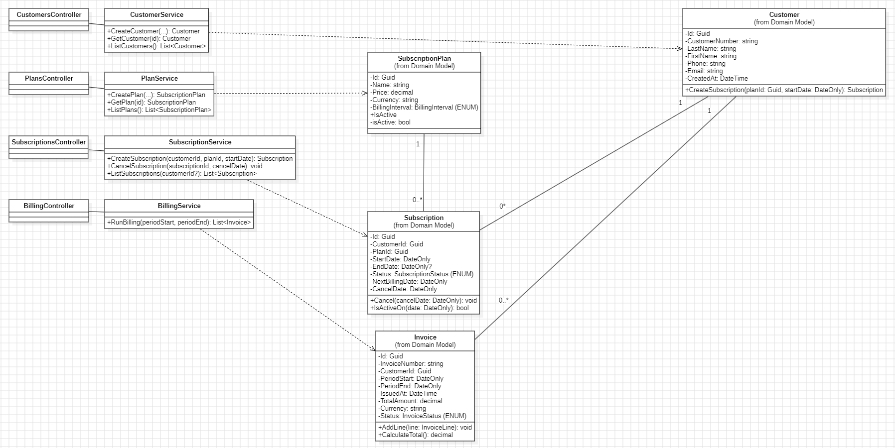

# Architecture Overview

This project implements a backend service for subscription and billing management.

## Architectural Style
- Layered architecture
- REST-based API
- Clear separation of concerns

## Main Layers
- **API Layer**  
  Controllers exposing REST endpoints.

- **Application / Service Layer**  
  Business logic (e.g. subscription handling, billing processes).

- **Domain Layer**  
  Core domain models such as Customer, Subscription, Invoice.

- **Infrastructure / Data Layer**  
  Database access via Entity Framework Core.

## External Systems
- Payment Provider (external service) (future)
- Database (SQLite / MySQL)

## Diagrams
The following diagrams are used to describe the system:
- C4 Model – Level 1 (System Context)
- C4 Model – Level 2 (Container Diagram)
- UML Class Diagrams
- UML Sequence Diagrams

### C4 – Level 1 (System Context)

### C4 – Level 2 (Container Diagram)

### Sequence Diagram – Create Subscription

### Sequence Diagram – Create Customer

### Sequence Diagram – Create Subscriptionplan

### Sequence Diagram – Create Billing

### Domain Model

### API Model

